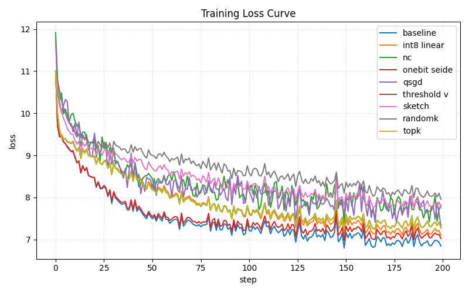

### 1.3 通信压缩效果对比
#### 1.3.1 目标（Goal）

在第 1.2 节中，我们从算法与实现两个层面对基于 FSDP 通信钩子的量化与稀疏化方法进行了系统梳理。然而，单纯从“比特数减少了多少”“稀疏率达到多少”这样的静态指标，并不能回答通信压缩在实际训练中的关键问题：**在给定硬件与模型配置下，这些压缩方法究竟能在多大程度上降低通信开销，又会在多大程度上伤害训练质量**。一方面，压缩必然在梯度上引入偏差和额外方差，可能导致损失曲线收敛变慢、最终困惑度（PPL）劣化；另一方面，实现压缩与解压本身也需要额外计算与通信步骤，其带宽节省能否真正体现为端到端吞吐（tokens/s）的提升，很大程度上取决于具体的通信拓扑与算力–带宽比。

基于此，本节的目标可以概括为三个层面：（1）从**训练质量**角度，对比 baseline 无压缩与不同通信压缩算法在相同训练步数或 epoch 内的 `Loss/step` 收敛速度与平滑程度，以及在同源 Wikipedia held‑out 验证集上的最终 `PPL` 表现，回答“压缩在多大程度上牺牲了收敛质量”；（2）从**系统效率**角度，在完全对齐的模型、数据和优化配置下，比较各方法的吞吐（tokens/s）、显存占用（allocated/reserved）以及每 step 每 rank 的通信字节数（bytes/step），回答“是否真正缓解了通信瓶颈、是否提升了整体训练效率”；（3）从**机制解释**角度，利用运行时记录的梯度压缩误差（相对 \(\ell_2\) 误差 \(\|g-\hat g\|_2/\|g\|_2\)）与上述质量、效率指标进行关联分析，帮助理解不同算法在“压缩强度—梯度扭曲程度—训练效果”三者之间形成的实际权衡。

为保证对比的公平性，本节所有实验均在严格对齐的训练配置下进行：保持训练数据、模型结构、优化器与学习率调度、随机种子、并行规模（world size）、序列长度和 batch 配置完全一致，仅在通信相关参数（如 `comm_hook` 类型、是否启用误差反馈、本地 EF 与全量 EF 的选择以及各算法特有超参数）上做差异化设置。所有结果均以无压缩的 FSDP baseline 作为参照系，重点报告相对于 baseline 的提升或下降幅度，而非孤立的绝对数值，从而尽量减弱不同硬件环境和运行噪声对结论的干扰。

---

#### 1.3.2 实验配置与数据采集方法

本节所有对比实验均在严格控制的统一配置下进行，以确保不同通信压缩算法之间的结果具有可比性。整体配置风格与 1.1 节的通信瓶颈识别实验保持一致，仅在模型规模和序列长度上做了适当放大，以更贴近当前 LLM 训练场景。表 1‑3 总结了本节使用的核心实验配置。

**表 1‑3 通信压缩效果对比实验配置**

| 参数项 | 配置值 | 说明 |
| :--- | :--- | :--- |
| Experiment Environment | Ubuntu24.04, 2×A100 (40GB) | 实验环境操作系统与 GPU 硬件配置 |
| Training Dataset | Wikipedia En 500MB（tokenized，seq=1024） | 使用 `wikipedia_en_500mb.json` 作为训练语料，通过 `build_tokenized_shards.py` 预先切分并缓存为固定序列长度的 token 化 shard，保证各方法在完全相同的训练样本分布上比较 |
| Validation Dataset | 同源 Wikipedia held‑out 5% | 在与训练集同源的 Wikipedia 语料中按样本划出约 5% 作为 held‑out 验证集，通过 `collect_training_metrics.py --eval_wiki_5pct` 自动评估 PPL，用于衡量不同通信配置下的泛化差异 |
| Model Architecture | GPT‑2, Random Init, small/medium | 采用随机初始化 GPT‑2，以聚焦通信与训练行为本身，排除预训练差异干扰 |
| Precision | AMP (FP32 权重 + bfloat16 前向) | 使用 autocast(bfloat16) 进行前向与反向计算，在不改变通信算子 dtype 的前提下降低算子带宽需求 |
| Global Batch Size | 固定（由 per‑GPU batch × world size × grad‑acc 决定） | 在不同通信配置下保持 global batch 不变，避免 batch 差异影响 loss/PPL 与吞吐 |
| Sequence Length | 1024 | 使用较长序列以放大每步计算与通信负载，更贴近实际 LLM 训练场景 |
| World Size | 2（单机双卡） | 默认采用单机 2 卡 FSDP 训练；多机场景仅在后文作为扩展讨论 |
| Optimizer & LR Schedule | AdamW + 线性 warmup/decay | 在各配置间保持完全一致，确保差异主要来自通信策略 |
| Training Horizon | 若干 epoch 或固定 max_steps | 长程收敛实验使用相同 epoch 数，短跑实验使用相同 max_steps 截断，以对齐比较区间 |
| Comm Hook | {none, int8, nc, qsgd, onebit_seide, topk, randomk, thresholdv, sketch, …} | 通过统一的 FSDP 通信钩子框架切换不同压缩算法 |
| Error Feedback | on/off, local/full | 统一通过 `comm_error_feedback` / `comm_ef_local` 控制，便于分析 EF 对误差与收敛的影响 |

数据采集方面，我们对每次实验 run 记录两类信息：一类是**训练过程数据**，包括随 step 变化的训练损失 `Loss/step`、学习率 `LearningRate/step`、GPU 显存占用（allocated/reserved）以及基于 wall‑clock 时间估算的吞吐（tokens/s）；另一类是**通信与压缩误差数据**，包括每 step 每 rank 的通信字节数（bytes/step per rank）以及在误差反馈更新时记录的梯度相对 \(\ell_2\) 误差样本。前者用于刻画不同通信配置下的收敛行为和系统性能，后者则用于量化压缩强度与训练效果之间的对应关系。

在后续 1.3.3 小节的对比分析中，我们将基于上述统计结果，对各通信压缩算法在“训练质量–通信量–吞吐–梯度误差”四个维度上的表现进行统一汇总与讨论。

#### 1.3.3 实验结果：各压缩算法的统一对比

在本节中，图1-4 给出了不同通信压缩算法在表1-2配置下的训练 loss 曲线，表1-3则汇总了训练质量、系统吞吐与梯度压缩误差等关键指标。其中baseline表示原始 FSDP 框架。

**表 1‑4 通信压缩算法统一对比汇总（短跑实验，200 steps）**

| 压缩算法 | 关键超参 | 最后 20 个 step 的平均 loss | 验证集 Perplexity | 训练吞吐（tokens/s） | 压缩比/稀疏率 | 平均梯度误差（L2 范数） | 通信耗时（step1，ms） | 计算‑通信覆盖率 | GPU 显存预留值（step2，Reserved\_GB\_max） |
| :-- | :-- | :-- | :-- | :-- | :-- | :-- | :-- | :-- | :-- |
| baseline | - | 6.9499 | 5324.56 | 10578.96 | 1× | - | 26564.78 | 0.604 | 37.57 |
| int8 linear | variant=linear | 7.2162 | 5677.46 | 14321.25 | 压缩比≈4× | 0.5922 | 13727.28 | 0.759 | 37.97 |
| natural compression | bit_packing=True, EF=True | 7.7415 | 6937.58 | 12936.38 | 压缩比≈3.56× | - | 17148.23 | 0.626 | 38.46 |
| onebit seide | col_size=256, use_cpp=True | 7.1214 | 5545.15 | 12384.80 | 压缩比≈32× | 1.0642 | 11160.23 | 0.647 | 38.81 |
| qsgd | s=4, bucket=0 | 7.7470 | 7037.46 | 11712.42 | 压缩比≈4× | 1.1821 | 13630.69 | 0.759 | 38.54 |
| threshold v | auto threshold | 7.3756 | 6186.17 | 12027.74 | 自适应稀疏，平均稀疏率≈0.71 | 0.7164 | 12858.59 | 0.824 | 38.58 |
| sketch | (sketch) | 7.8575 | 7166.74 | 11941.57 | 频域草图压缩，总通信最高约 40× | 0.9553 | 17291.79 | 0.590 | 38.63 |
| randomk | ratio=0.01 | 8.0925 | 8053.88 | 11837.80 | 稀疏率=0.01 | 7.2219 | 12306.74 | 0.814 | 38.64 |
| topk | ratio=0.01 | 7.3752 | 6071.02 | 14071.59 | 稀疏率=0.01 | 0.8159 | 13343.68 | 0.805 | 37.85 |

从表 1‑4 可以更直观地看出不同算法在“训练质量–通信量–梯度误差”三者之间形成的具体权衡。首先，在**训练质量**上，baseline 的最后 20 个 step 平均 loss 为 6.95，作为参照；在所有压缩方法中，`onebit seide` 的 7.12 最接近 baseline，其次是 `int8 linear` 的 7.22、`threshold v` 与 `topk` 的 7.38 左右，验证集 PPL 也都维持在 4500–6200 的区间，说明在 4× 量化或 1% 稀疏率下，只要方向信息保留得足够好，整体收敛质量仍然可接受。`natural compression`、`qsgd` 和 `sketch` 的 loss 分别升至 7.74、7.75 和 7.86，对应的 PPL 也更高，表明在当前配置下它们牺牲了一部分收敛精度来换取更高的压缩比；而 `randomk` 的平均 loss 达到 8.09、PPL 超过 8000，明显劣于其它所有方法，反映出在仅保留 1% 梯度且方向随机的设定下，噪声被大幅放大。

其次在**通信与吞吐**维度，baseline 的通信耗时约为 2.66×10^4 ms，对应吞吐 1.06×10^4 tokens/s；所有压缩方法都在不同程度上缩短了通信时间：`onebit seide` 最激进（约 1.12×10^4 ms），`int8 linear`、`randomk` 和 `topk` 也都将通信时间压缩到 1.2×10^4–1.4×10^4 ms 区间，并给出 1.18×10^4–1.40×10^4 tokens/s 的吞吐，其中 `topk` 在保证较好收敛质量的同时达到最高吞吐。`natural compression` 与 `qsgd` 在通信时间和吞吐上略逊于 `int8 linear`，但仍明显优于 baseline；`threshold v` 的通信时间介于 `int8`/`topk` 与 baseline 之间，在带宽节省与 loss 抬升之间取得中庸折中；`sketch` 虽然论文中标称最高可达 40× 总通信压缩，但由于两轮通信与重建开销，其实际通信耗时在各方法中反而偏高，提示在工程实现中需要谨慎评估“名义压缩比”与端到端收益之间的落差。

最后，从**梯度误差与显存占用**来看，`rel L2 mean` 一列表明 `int8 linear`、`threshold v` 与 `topk` 的相对 \(\ell_2\) 误差大致在 0.6–0.8 之间，`onebit seide` 与 `sketch` 稍高（约 1.06 和 0.96），但仍远低于 `randomk` 的 7.22；`natural compression` 与 `qsgd` 在当前 run 中误差统计缺失，但结合 loss/PPL 可以推断其位于“中等误差”的区间。所有方法的 GPU 显存预留峰值都集中在 37–39 GB 之间（baseline、int8、natural compression、onebit、qsgd、threshold v、sketch、randomk、topk 的差异均不到 2 GB），远小于通信与收敛上的差别，说明在当前模型与 batch 设定下，**通信压缩主要是在“时间—带宽”维度做文章，对显存峰值的影响可以近似忽略**。综合来看，如果以“训练质量优先”为目标，baseline、`int8 linear`、`topk` 与 `threshold v` 是更稳健的选择；若在带宽更受限场景追求更高压缩比，则可以考虑 `onebit seide`、`natural compression` 或 `sketch`，但需要结合误差反馈与学习率调节，避免像 `randomk` 这样在高压缩率下牺牲过多收敛精度。

### 2 后期拟完成的研究工作及进度安排
#### 2.1 后期拟完成的研究工作
后续需要完成的工作主要包括以下几个方面。其一，基于当前已实现的多种通信压缩算法的对比结果，设计并实现一个新的通信压缩算法，结合 1-bit Seide 在压缩比和收敛质量上的优势，进一步优化通信效率与训练稳定性之间的平衡。其二，将新算法扩展到多机多卡场景进行测试，验证其在大规模集群环境下的可扩展性和性能表现。其三，完善论文的撰写工作，包括实验结果的深入分析、相关工作的补充讨论以及结论的总结。

#### 2.2 进度安排
具体进度安排如下：
2026年3月10日——2026年3月25日：基于当前研究成果设计新的通信压缩算法，并完成代码实现与初步测试。
2026年3月26日——2026年4月10日：在多机多卡环境下对新算法进行系统性测试，收集并分析实验数据，与现有方法进行对比。
2026年4月11日——2026年4月20日：完善论文撰写，补充实验分析与讨论，完成初稿。
2026年4月21日——2026年4月30日：论文修改与定稿，准备答辩材料。

### 3 存在的困难及解决方案
#### 3.1 存在的困难
1. 新算法设计需要在压缩比、收敛质量和实现复杂度之间进行精细平衡，理论分析与工程实现都存在一定挑战。
2. 多机多卡环境下的测试需要协调多个计算节点，对实验环境和调试能力要求较高。
3. 论文撰写需要对大量实验数据进行深入分析和提炼，确保逻辑清晰、论证充分。

#### 3.2 解决方案
针对目前存在的问题和困难，提出以下解决方案：
1. 充分借鉴现有算法（如 1-bit Seide、Top-k 等）的设计思路，通过模块化组合和渐进式优化来降低新算法的设计难度，同时利用已有的测试框架快速验证原型。
2. 利用课题组已有的高性能计算资源，提前规划实验 schedule，采用小规模预实验验证正确性后再进行大规模测试，同时充分利用日志和性能分析工具定位问题。
3. 按照论文结构分模块撰写，先完成实验结果部分，再逐步完善引言、相关工作和结论，定期与指导老师沟通，确保论文质量和进度。

#### 4 论文按时完成的可能性
本课题目前已经完成了 FSDP 通信瓶颈分析、多种通信压缩算法的复现与实现，以及在单机双卡环境下的系统性对比实验，获得了丰富的实验数据和初步结论。目前正在进行新算法的设计思路梳理，将要开展新算法的实现与测试。综上所述，在前期工作的坚实基础上，通过合理的进度安排和有效的问题解决措施，论文能够按期完成，并取得有价值的研究成果。