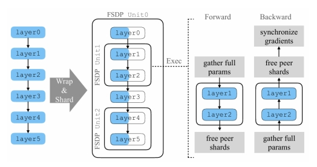
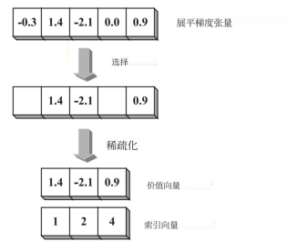
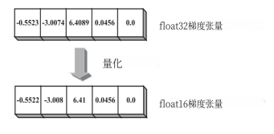
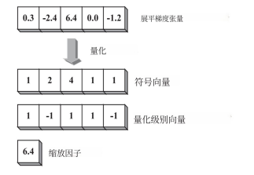

# 未命名

**哈尔滨工业大学深圳校区**

**毕业论文开题报告**

|题 目|<u><u>  </u></u><u><u>基于PyTorch-FSDP分布式训练的通信数据压缩研究</u></u><u><u>                        </u></u>|
| -------------| -----------------------|
|姓  名|<u><u>          </u></u><u><u>王云龙</u></u><u><u>              </u></u>|
|学  号|<u><u>        </u></u><u><u>220110608</u></u><u><u>             </u></u>|
|学  院|<u><u>     </u></u><u><u>计算机科学与技术</u></u><u><u>               </u></u>|
|专  业|<u><u>     </u></u><u><u>计算机科学与技术</u></u><u><u>                  </u></u>|
|指 导 教 师|<u><u>          </u></u><u><u>施少怀</u></u><u><u>              </u></u>|
|日  期|<u><u>     </u></u><u><u> 2025年10月3日</u></u><u><u>              </u></u>|

目  录

[<u>](#_Toc207802815)​<u>[1  课题背景及研究的目的和意义]()</u>​<u>[&lt;/u&gt; ](#_Toc207802815)</u>

[&lt;u&gt;](#_Toc207802816)​<u>[1.1]()</u>​<u>[&lt;/u&gt;&lt;u&gt;](#_Toc207802816)</u>​<u>  </u>​<u>[&lt;/u&gt;&lt;u&gt;](#_Toc207802816)</u>​<u>课题背景</u>​<u>[&lt;/u&gt; ](#_Toc207802816)</u>

[&lt;u&gt;](#_Toc207802817)​<u>[1.2]()</u>​<u>[&lt;/u&gt;&lt;u&gt;](#_Toc207802817)</u>​<u>  </u>​<u>[&lt;/u&gt;&lt;u&gt;](#_Toc207802817)</u>​<u>研究的目的和意义</u>​<u>[&lt;/u&gt; ](#_Toc207802817)</u>

[&lt;u&gt;](#_Toc207802818)​<u>[2  国内外研究现状及分析]()</u>​<u>[&lt;/u&gt; ](#_Toc207802818)</u>​<u>**[3](#_Toc207802818)</u>**

[&lt;u&gt;](#_Toc207802819)​<u>[2.1  国内外研究现状]()</u>​<u>[&lt;/u&gt; 3](#_Toc207802819)</u>

[&lt;u&gt;](#_Toc207802820)​<u>[2.2  ]()</u>​<u>[&lt;/u&gt;&lt;u&gt;](#_Toc207802820)</u>​<u>国内外文献综述及简析</u>​<u>[&lt;/u&gt; 3](#_Toc207802820)</u>

[&lt;u&gt;](#_Toc207802821)​<u>[2.2.1]()</u>​<u>[&lt;/u&gt;&lt;u&gt;](#_Toc207802821)</u>​<u>分布式训练框架与并行策略研究</u>​<u>[&lt;/u&gt;&lt;u&gt;](#_Toc207802821)</u>​<u>现状</u>​<u>[&lt;/u&gt; 3](#_Toc207802821)</u>

[&lt;u&gt;](#_Toc207802822)​<u>[2.2.2]()</u>​<u>[&lt;/u&gt;&lt;u&gt;](#_Toc207802822)</u>​<u>分布式训练通信优化研究现状</u>​<u>[&lt;/u&gt; 4](#_Toc207802822)</u>

[&lt;u&gt;](#_Toc207802823)​<u>[3  主要研究内容及研究方案]()</u>​<u>[&lt;/u&gt; ](#_Toc207802823)</u>​<u>**[6](#_Toc207802823)</u>**

[&lt;u&gt;](#_Toc207802824)​<u>[3.1  研究内容]()</u>​<u>[&lt;/u&gt; 6](#_Toc207802824)</u>

[&lt;u&gt;](#_Toc207802825)​<u>[3.1.1]()</u>​<u>[&lt;/u&gt;&lt;u&gt;](#_Toc207802825)</u>​<u>训练过程通信瓶颈分析</u>​<u>[&lt;/u&gt; 6](#_Toc207802825)</u>

[&lt;u&gt;](#_Toc207802826)​<u>[3.1.2 压缩算法设计与优化]()</u>​<u>[&lt;/u&gt; 6](#_Toc207802826)</u>

[&lt;u&gt;](#_Toc207802826)​<u>[3.1.3 收敛性测试和性能测试]()</u>​<u>[&lt;/u&gt; 6](#_Toc207802826)</u>

[&lt;u&gt;](#_Toc207802827)​<u>[3.2  ]()</u>​<u>[&lt;/u&gt;&lt;u&gt;](#_Toc207802827)</u>​<u>研究方案</u>​<u>[&lt;/u&gt; 6](#_Toc207802827)</u>

[&lt;u&gt;](#_Toc207802828)​<u>[4  进度安排及预期目标]()</u>​<u>[&lt;/u&gt; ](#_Toc207802828)</u>​<u>**[8](#_Toc207802828)</u>**

[&lt;u&gt;](#_Toc207802829)​<u>[4.1  进度安排]()</u>​<u>[&lt;/u&gt; 8](#_Toc207802829)</u>

[&lt;u&gt;](#_Toc207802830)​<u>[4.2  预期目标]()</u>​<u>[&lt;/u&gt; 8](#_Toc207802830)</u>

[&lt;u&gt;](#_Toc207802831)​<u>[5  已具备和所需的条件和经费]()</u>​<u>[&lt;/u&gt; ](#_Toc207802831)</u>​<u>**[9](#_Toc207802831)</u>**

[&lt;u&gt;](#_Toc207802832)​<u>[5.1  实验室条件和经费保障]()</u>​<u>[&lt;/u&gt; 9](#_Toc207802832)</u>

[&lt;u&gt;](#_Toc207802833)​<u>[5.2  所需条件和经费]()</u>​<u>[&lt;/u&gt; 9](#_Toc207802833)</u>

[&lt;u&gt;](#_Toc207802834)​<u>[6  预计困难及解决方案]()</u>​<u>[&lt;/u&gt; ](#_Toc207802834)</u>​<u>**[1](#_Toc207802834)</u>**​[&lt;u&gt;]()​<u>[0&lt;/u&gt;]()</u>

<u>[&lt;u&gt;](#_Toc207802835)</u>​<u>6.1  预计困难与技术难点</u>​<u>[&lt;/u&gt; 1](#_Toc207802835)</u>​<u>[&lt;u&gt;]()</u>​<u>0</u>​<u>[&lt;/u&gt;]()</u>

<u>[&lt;u&gt;](#_Toc207802836)</u>​<u>6.2  </u>​<u>[&lt;/u&gt;&lt;u&gt;](#_Toc207802836)</u>​<u>解决方案</u>​<u>[&lt;/u&gt; 1](#_Toc207802836)</u>​<u>[&lt;u&gt;]()</u>​<u>0</u>​<u>[&lt;/u&gt;]()</u>

<u>[&lt;u&gt;](#_Toc207802837)</u>​<u>参考文献</u>​<u>[&lt;/u&gt; ](#_Toc207802837)</u>​<u>**[1](#_Toc207802837)</u>**​<u>[&lt;u&gt;]()</u>​<u>1</u>​<u>[&lt;/u&gt;]()</u>

<u>[1\*\*  课题背景及研究的目的和意义\*\*]()</u>

<u>[1.1  课题背景]()</u>

<u>[近年来，随着深度学习技术的不断突破，诞生了如ChatGPT［1］和BERT［2］等大语言模型（LLM），为生物医学、智能法律、教育辅助等领域带来了革命性的应用潜力。研究表明，LLMs的性能提升与其本身的参数规模呈现强相关性，例如GPT-3使用1750 亿参数在零样本和少样本任务中表现出超越前代模型的能力［3］，而GPT-4通过万亿级参数进一步实现了复杂推理与多模态理解［4］。]()</u>

<u>[在深度学习模型规模呈指数级增长趋势的时代背景下，LLM的训练过程正面临着严峻的挑战。单机训练这类超大规模模型几乎不可能，因为模型参数和中间激活值的内存需求远远超过了单个GPU或TPU的内存容量。以GPT-4模型为例，其千亿级别的模型参数就需要数百GB的存储空间，再加上训练过程中的梯度、优化器状态和中间激活值，总内存需求已经达到TB级别。单机显存的不足促使了分布式训练的出现，目前分布式训练已经成为了LLMs训练的必要手段［5］［6］，当前主流分布式训练框架如 Megatron-LM［7］、DeepSpeed ［8］及 PyTorch-FSDP（Fully Sharded Data Parallelism）［9］已广泛应用于 LLMs 训练。]()</u>

<u>[其中，PyTorch-FSDP通过将模型参数、梯度和优化器状态分片到多个设备上，显著减少了单个设备的内存需求［9］。然而在分布式训练流程中，节点之间需要频繁同步梯度、参数等数据以保证模型一致性，随着集群规模的扩大和模型参数的增长，通信开销成为制约训练效率的核心瓶颈，在此背景下，研究基于PyTorch-FSDP分布式训练的通信数据压缩技术具有重要价值。通过将通信压缩技术与PyTorch-FSDP相结合，可以降低通信开销，提高训练效率，直接降低超大规模模型的训练能耗和碳足迹。]()</u>

<u>[1.2  研究的目的和意义]()</u>

<u>[如今，LLM的模型规模和训练数据正不断扩大，这虽然带来了可观的性能，但也使得通信开销成为新的制约训练效率的核心瓶颈［10］。通信开销的根源在于传统分布式中存在“计算-通信失衡”的问题，且节点间通信还受限于PCIe总线带宽、数据传输协议等硬件和软件瓶颈。此外，LLMs训练中的梯度数据具有高冗余性——梯度向量中约有80%-90%的元素绝对值接近零，对模型更新贡献极小，传输完整梯度存在着严重的带宽浪费。]()</u>

<u>[本研究旨在针对PyTorch-FSDP分布式训练框架，系统研究通信数据压缩技术的实现方法、优化策略和性能影响，并针对LLMs训练中通信开销大、精度与压缩程度平衡难等问题，提出适配PyTorch-FSDP分片机制的通信数据压缩方案。]()</u>

<u>[2\*\*  国内外研究现状及分析\*\*]()</u>

## <u>[2.1  国内外研究现状]()</u>

<u>[国内外的学者围绕分布式训练中多机多卡协同以及高效通信这方面已经开展了深入探索。]()</u>

<u>[在分布式训练体系架构方面，典型的架构包括参数服务器（Parameter Sever, PS）［5］、All-Reduce［6］以及去中心化［11］等多种训练体系，以及数据并行［11］、张量、流水线并行［12］［13］与3D并行［14］等组合策略。而在数据并行的主线下，基于ZeRO显存优化技术［15］的PyTorch-FSDP作为PyTorch生态原生的全分片数据并行技术，在工业界受到了广泛关注。作为一种通用的分布式训练框架，PyTorch-FSDP通过将模型参数、梯度、优化器状态全部分片到不同的GPU节点，解决了传统数据并行（DDP）中单节点内存占用过高的问题。]()</u>

<u>[在高效通信领域，一方面减少通信轮次是降低通信开销的有效方法。实现这一目标的基本思路有两种：一是选择较大的批次大小（batch size）以加快收敛速度，二是执行多轮本地计算后采用周期性通信，即减少各节点之间的同步频率。另一方面，除开减少通信次数之外，还存在一种颇具研究价值的方法，即通信压缩（communication compression），该方法通过减少每轮迭代中待传输梯度的数据量，或者采用更少比特数对梯度进行编码，从而缩短梯度同步时的通信时间，而如何将通信压缩技术合理的应用到PyTorch-FSDP训练框架下优化通信效率，是本文的主题。]()</u>

<u>[2.2  国内外文献综述及简析]()</u>

<u>[2.2.1分布式训练框架与并行策略研究现状]()</u>

<u>[近年来，分布式训练与并行化已经成为大模型时代“基础设施”。]()</u>

<u>[在目前工业界主流训练框架中，Deepak Narayanan等人提出了综合利用张量并行、流水线并行以及数据并行等多种并行策略组合而成的高效的大型Transformer语言模型训练框架Megatron-LM，成功使得大模型的训练过程能够扩展至数千GPU，并证明了不同的并行策略之间存在非平凡相互作用：策略会影响通信量、内核算效以及流水线气泡等［7］；]()</u>

<u>[Jeff Rasley等人则利用ZeRO内存优化体系提出了DeepSpeed深度学习通用分布式训练框架，且得益于其关键组件ZeRO并行优化器，DeepSpeed能够显著减少模型并行与数据并行所需要的资源，并大幅提升可训练参数规模，此外DeepSpeed还提供了与PyTorch兼容的轻量级API，极大地降低了学习成本，提高了框架的扩展性［8］；]()</u>

<u>[最后Y. Zhao等人受DeepSpeed的ZeroRedundancy Optimizer的启发，通过对模型参数进行全分片的并行化策略实现了一种工业级的大模型训练解决方案，既能达到与Distributed Data Parallel（DDP）相当的性能，同时又能支持显著更大的模型规模［9］。]()</u>

<u>[图 4-PyTorch-FSDP整体流程图［9］]()</u>

<u>[ PyTorch-FSDP通过切分（shard）稠密参数来扩展到单卡放不下的大模型。更具体地，PyTorch-FSDP把一个模型实例分解为多个更小的单元并分别处理。在前向与反向计算过程中，PyTorch-FSDP一次只收集一个单元的完整参数与梯度；其余单元的参数与梯度始终保持为分片状态。且整个训练循环中，优化器状态也保持分片。因此，PyTorch-FSDP 的显存需求与“分片后的模型大小 + 最大那个完全收集后的PyTorch-FSDP单元的大小”成正比。]()</u>

<u>[如图1所示，对于一个6层的简单模型，假设PyTorch-FSDP将模型分解为三部分：[layer0, layer3]、[layer1, layer2] 与 [layer4, layer5]（在实际应用中，模型的分解方式可以由用户自定义函数来控制）随后，PyTorch-FSDP将每一部分都包裹为一个PyTorch-FSDP单元并相应地切分参数并存放在分布式节点上。为保证训练过程中模型计算正确，PyTorch-FSDP需要在对应计算开始前恢复未切分的参数。  以包含 [layer1, layer2] 的 unit1 为例：在前向进入 layer1 之前，PyTorch-FSDP通过从其他分布式节点上收集分片来得到 layer1 与 layer2 的完整参数，使得PyTorch-FSDP能够在本地执行这些层的计算。计算完成之后，PyTorch-FSDP会立即释放刚收集来的其他节点的分片以降低显存占用。因此，在整个前向过程中，PyTorch-FSDP任意时刻只需完全实体化一个单元，其他单元都可保持分片。]()</u>

<u>[类似地，在反向计算中，unit1 会在反向即将到达 layer2 之前恢复 layer1 与 layer2 的未切分参数。当自动求导引擎完成这两层的反向计算后，PyTorch-FSDP立即释放其他节点的分片数据并启动 Reduce-Scatter，对梯度进行规约并重新切分。这样可以保证反向结束后，每个节点仅保留自己那一份参数与梯度的分片。]()</u>

<u>[2.2.2分布式训练通信优化研究现状]()</u>

<u>[这一领域的研究主要分为通信次数的优化以及通信数据量的压缩。]()</u>

<u>[在通信次数的优化领域，一个自然的并行化方向是增大Batch Size的大小，从而减少模型达到收敛时所需要的训练次数，更少的训练轮次意味着训练时各GPU节点梯度同步频率的降低，从而提高通信效率［16］，但是在N.S. Keskar和E. Hoffer的研究表明，增大Batch Size的训练更容易使，模型陷入“尖锐局部极小值”，使得深度神经网络模型的性能难以达到理想水平，此外增大Batch Size也会降低模型的泛化能力［17］；另一种做法便是A. Resiziadeh等人提出的一种以周期性聚合与量化为核心、并支持部分参与的通信高效联邦学习算法，核心在于各节点在于服务器同步前进行若干轮本地更新，再周期性地把模型上传，以此显著减少通信轮次与总通信量，但是过多的本地更新会导致模型趋向于收敛到局部最优解［18］。]()</u>

<u>[而在通信数据量的压缩领域，致力于减少每轮通信中传输的数据量而非通信的次数，从核心思想出发，通信压缩主要分为两类：稀疏化和量化。]()</u>

<u>[稀疏化的核心思想是仅传输对深度神经网络模型训练收敛具有显著影响的大梯度元素，目前主流的稀疏化方法包括仅发送随机梯度中最重要的分量（top-k 稀疏化）［19］、通过正负双阈值过滤小梯度的threshold-v［20］以及对整个梯度张量进行Sketch映射（Sketched-SGD）［21］或矩阵分解（GradiVeQ）［22］并以此为根据保留重要元素。]()</u>

<u>[图 1-梯度稀疏化示例流程［10］]()</u>

<u>[在量化方面，可以归纳为两大机制：截断表达和码本映射。前者的主要区别在于单个梯度元素所使用的比特数，例如FP16［23］和8- BITAPPROXIMATIONS［24］方法分别使用16 bit和8 bit表示每个元素，而截断表示的极端情况是1位随机梯度下降（1-Bit SGD）［25］和符号随机梯度下降（SignSGD）［26］，这两种方法均采用单个比特来表示每个梯度元素。码本映射方面，主要分为均匀映射与非均匀映射两类，两者的主要区别在于均匀映射的相邻量化等级之间具有相同的区间值，例如QSGD［27］将原始梯度按量化等级将区间(0, 1)等分，再利用一个随机变量确保量化后的梯度期望与原始期望一致，从而减少对模型收敛的偏差影响；非均匀映射的相邻量化等级区间值则各不相同，注重表示梯度元素的分布情况，例如NC［28］采用非均匀量化等级，将元素值舍入到与其最接近的两个2的整数次幂值之一，再辅之以特定概率的方式，使其成为一种无偏的通信量化方法。]()</u>

<u>[图 2-量化方法一：截断表示［10］]()</u>

<u>[图 3-量化方法二：码本映射［10］]()</u>

<u>[3\*\*  主要研究内容及研究方案\*\*]()</u>

## <u>[3.1  研究内容]()</u>

<u>[本研究旨在围绕PyTorch-FSDP框架下的通信优化，探索高效的通信数据压缩方法，如梯度量化、稀疏化、低秩近似等策略，减小训练过程中的通信开销，提高PyTorch-FSDP分布式训练框架的扩展性和训练效率，并为构建高效、可扩展的大模型训练系统提供理论与实践依据。期望能够在典型大模型的分布式训练中，梯度/参数通信量压缩比达到2-4倍，同时在常用数据集上的模型精度下降不超过1%。]()</u>

<u>[3.1.1训练过程通信瓶颈分析]()</u>

<u>[构建PyTorch-FSDP的通信与计算性能模型，分析PyTorch-FSDP训练框架下的通信环节，如All-Gather、Reduce-Scatter等，找到PyTorch-FSDP训练框架下的通信特征，识别训练过程中的关键瓶颈环节。]()</u>

<u>[3.1.2压缩算法设计与优化]()</u>

<u>[在现有的通信压缩算法的基础上，如随机稀疏化、Top-k/Random-k、误差反馈和常见的低比特截断表示等算法，针对PyTorch-FSDP训练框架进行适配，并在真实的大模型训练场景下，对比分析这几类通信压缩算法的优劣之处。挑选出最优的压缩算法，并针对PyTorch-FSDP框架下的通信模型进行改进。]()</u>

<u>[3.1.3收敛性测试和性能测试]()</u>

<u>[在针对PyTorch-FSDP训练框架进行通信瓶颈的优化之后，需要对优化后训练框架进行多维度的测试，如训练过程节点之间的通信开销、模型的收敛情况等，确保在通信压缩下模型收敛的稳定性，以及训练速度的提升。]()</u>

<u>[3.2  研究方案]()</u>

<u>[针对上述研究内容，制定如下研究流程：]()</u>

1. <u>[定位PyTorch-FSDP中的通信瓶颈：搭建精细化通信监测环境，基于 PyTorch Profiler 工具与 NVIDIA Nsight Systems 等硬件性能分析平台，对 FSDP 核心通信操作（All-Gather、Reduce-Scatter、All-Reduce）进行全周期数据记录。其次，结合训练全流程构建多维度通信画像：从时间维度，分析通信操作与计算操作的时序重叠率；从空间维度，对比不同模型层的通信数据量分布差异；从硬件适配维度，记录不同 GPU 集群拓扑（如单机多卡、多机多卡）下通信操作的性能波动。最后，基于画像数据定位核心瓶颈，将其列为优先优化对象，并分析瓶颈产生的底层原因。]()</u>
2. <u>[设计在PyTorch-FSDP框架下的压缩算法：首先，复现基础压缩算法并开展基准测试。在 PyTorch-FSDP 框架中集成主流稀疏化与量化算法：稀疏化算法重点实如Top-k、Random-k等，并适配 FSDP 分片特性；量化算法则复现如8-bit（INT8/FP8）、FP16浮点量化等算法，针对训练过程中的参数传输，将 FP32 格式参数量化为低位宽格式，同时在参数重构后执行反量化以保证计算精度。复现完成后，以 ResNet-50、BERT-base 等典型模型为测试对象，对比不同算法的通信量削减比例、训练吞吐量与精度损失等训练指标，筛选出适配 FSDP 框架的高效压缩方案。]()</u>  
   <u>[其次，针对基础算法的局限性进行改进优化。例如，Top-k 稀疏化在小梯度分片场景下筛选偏差较大，导致单次梯度波动误筛关键小梯度的问题；8-bit 量化在大模型参数传输中精度损失累积的问题，针对特定算法存在的局限性进行优化改进，此外，需确保改进算法与 FSDP 的动态分片、参数预取机制兼容，例如在压缩操作后同步更新分片元数据，避免因数据格式变化导致分片重构失败。]()</u>
3. <u>[系统性测试：对优化后的训练框架进行多维度、多场景的评测，设定分层测试变量与评测指标体系。测试变量涵盖模型规模（从小型 ResNet-18、中型 BERT-large 到大型 LLaMA-7B）、FSDP 分片参数（如分片粒度：按层分片 / 按模块分片、预取策略：静态预取 / 动态预取）、压缩算法配置（如稀疏化比例、量化位宽、误差补偿开关）等；评测指标分为三类：通信性能指标（总通信数据量、平均通信延迟、通信耗时占比）、训练效率指标（迭代速度、总训练时长、GPU 内存占用峰值）、模型性能指标（训练收敛曲线、验证集准确率 / Perplexity、泛化能力测试（如 OOD 数据预测精度））。并开展对照实验与场景化测试，以 “无压缩 FSDP 训练” 为基准组，优化后框架为实验组，在相同硬件环境与训练超参下，对比不同模型规模的指标差异。整理测试数据形成优化效果报告，明确不同场景下的最优压缩算法配置，为后续工程化应用提供参考。]()</u>

<u>[4  进度安排及预期目标]()</u>

## <u>[4.1  进度安排]()</u>

<u>[本课题的研究时间为2025年9月开始至2026年4月份进行答辩，根据之前的项目经验，结合自身学习，科研攻关能力，针对课题研究计划，制定出下面的研究进度：]()</u>

1. <u>[2025年9月至2025年10月：学习分布式训练基础，掌握目前常见的分布式训练框架，熟悉PyTorch-FSDP分布式训练框架的使用，调研通信压缩相关文献，定位FSDP通信瓶颈。]()</u>
2. <u>[2025年10月-2026年02月：构建PyTorch-FSDP训练过程的通信与计算性能模型，识别训练过程中的关键瓶颈环节。]()</u>
3. <u>[2026年02月-2026年04月：在PyTorch-FSDP训练框架下设计优化压缩算法，并对优化后的训练框架进行性能测试。]()</u>

## <u>[4.2  预期目标]()</u>

<u>[预期目标是研制高效通信的分布式训练框架，本课题预期实现下面目标和成果：]()</u>

1. <u>[通信压缩率：在典型大模型（如GPT类、Transformer类模型）的分布式训练中，梯度/参数通信量压缩比达到 2–4倍，在相同带宽条件下显著提升训练吞吐率。]()</u>
2. <u>[精度保持性：在常用数据集（如ImageNet、Wikitext、C4）上的模型精度下降不超过 1%（Top-1 或 Perplexity 指标）。]()</u>

<u>[5  已具备和所需的条件和经费]()</u>

## <u>[5.1  实验室条件和经费保障]()</u>

<u>[目前的分布式训练学习等主要在哈尔滨工业大学（深圳）高性能计算云服务中心上进行。目前可以保证在常见的模型和较小的数据集上能够正常训练。后续会使用施少怀老师课题组的GPU资源针对大模型大数据集进行训练。]()</u>

## <u>[5.2  所需条件和经费]()</u>

<u>[后续对优化框架进行系统性测试时，可能需要更多的GPU资源以支撑超大模型和大规模数据集的训练。]()</u>

<u>[6  预计困难及解决方案]()</u>

## <u>[6.1  预计困难与技术难点]()</u>

<u>[课题进行需要学习的知识较多，涉及PyTorch相关API、NCCL集群通信、分布式训练基础知识与训练监视工具的使用等知识，各类知识之间跨度比较大，学习难度比较高。]()</u>

<u>[6.2  解决方案]()</u>

<u>[为了提高课题进展速度和效率，保证学习质量，采用边应用边学习再应用的方法进行主要知识的系统学习，并多动手实际操作，提供动手操作能力，也外后期打下良好的基础。]()</u>

<u>[参考文献]()</u>

<u>[［1］J. Devlin, M.-W. Chang, K. Lee, and K. Toutanova, “BERT: Pre training of deep bidirectional transformers for language understanding,” in the Conference of the North American Chapter of the Association for Computational Linguistics: Human Language Technologies, 2018.]()</u>

<u>[［2］T. Brown, B. Mann, N. Ryder, M. Subbiah, J. D. Kaplan, P. Dhariwal, A. Neelakantan, P. Shyam, G. Sastry, A. Askell et al., “Language models are few-shot learners,” Advances in Neural Information Processing Systems, vol. 33, pp. 1877–1901, 2020.]()</u>

<u>[［3］Tom B. Brown, Benjamin Mann, Nick Ryder, Melanie Subbiah, Jared Kaplan, Prafulla Dhariwal, Arvind Neelakantan, Pranav Shyam, Girish Sastry, Amanda Askell, Sandhini Agarwal, Ariel Herbert-Voss, Gretchen Krueger, Tom Henighan, Rewon Child, Aditya Ramesh, Daniel M. Ziegler, Jeffrey Wu, Clemens Winter, Christopher Hesse, Mark Chen, Eric Sigler, Mateusz Litwin, Scott Gray, Benjamin Chess, Jack Clark, Christopher Berner, Sam McCandlish, Alec Radford, Ilya Sutskever, and Dario Amodei. 2020. Language models are few-shot learners. Advances in Neural Information Processing Systems 33 (2020), 1877–1901.]()</u>

<u>[［4］J. Deng, W. Dong, R. Socher, L.-J. Li, K. Li, L. Fei-Fei, Imagenet: A large-scale hierarchical image database, in: 2009 IEEE Conference on Computer Vision and Pattern Recognition, Ieee, 2009, pp. 248–255.]()</u>

<u>[［5］M. Li, D. G. Andersen, J. W. Park, A. J. Smola, A. Ahmed, V. Josifovski, J. Long, E. J. Shekita, and B.-Y. Su, “Scaling distributed machine learning with the parameter server,” in 11th USENIX Symposium on Operating Systems Design and Implementation, 2014, pp. 583–598.]()</u>

<u>[［6］A. Gibiansky, “Bringing HPC techniques to deep learning,” Baidu Research, Tech. Rep., 2017.]()</u>

<u>[［7］ D. Narayanan, M. Shoeybi, J. Casper, P. LeGresley, M. Patwary, V. Korthikanti, D. Vainbrand, P. Kashinkunti, J. Bernauer, B. Catanzaro et al., “Efficient large-scale language model training on GPU clusters using megatron-lm,” in International Conference for High Performance Computing, Networking, Storage and Analysis, 2021, pp. 1–15.]()</u>

<u>[［8］J. Rasley, S. Rajbhandari, O. Ruwase, and Y. He, “DeepSpeed: System optimizations enable training deep learning models with over 100 billion parameters,” in the ACM SIGKDD International Conference on Knowledge Discovery &amp; Data Mining, 2020, pp. 3505–3506.]()</u>

<u>[［9］Y. Zhao, A. Gu, R. Varma, L. Luo, C.-C. Huang, M. Xu, L. Wright, H. Shojanazeri, M. Ott, S. Shleifer et al., “Pytorch FSDP: experiences on scaling fully sharded data parallel,” arXiv preprint, arXiv:2304.11277, 2023.]()</u>

<u>[［10］Wang Z, Wen M, Xu Y, Zhou Y, Wang JH, Zhang L. Communication compression techniques in distributed deep learning: A survey. Journal of Systems Architecture. 2023 Sep 1;142:102927.]()</u>

<u>[［11］Q. Luo, J. He, Y. Zhuo, and X. Qian, “Prague: High-performance heterogeneity- aware asynchronous decentralized training,” in Twenty Fifth International Conference on Architectural Support for Programming Languages and Operating Systems, 2020, pp. 401–416.]()</u>

<u>[［12］Y. Huang, Y. Cheng, A. Bapna, O. Firat, D. Chen, M. Chen, H. Lee, J. Ngiam, Q. V. Le, Y. Wu et al., “GPipe: Efficient training of giant neural networks using pipeline parallelism,” Advances in Neural Information Processing Systems, vol. 32, 2019.]()</u>

<u>[［13］A. Harlap, D. Narayanan, A. Phanishayee, V. Seshadri, N. Devanur, G. Ganger, and P. Gibbons, “PipeDream: Fast and efficient pipeline parallel DNN training,” arXiv preprint, arXiv:1806.03377, 2018.]()</u>

<u>[［14］Z. Lai, S. Li, X. Tang, K. Ge, W. Liu, Y. Duan, L. Qiao, and D. Li, “Merak: An efficient distributed dnn training framework with automated 3d parallelism for giant foundation models,” IEEE Transactions on Parallel and Distributed Systems, vol. 34, no. 5, pp. 1466–1478, 2023.]()</u>

<u>[［15］S. Rajbhandari, J. Rasley, O. Ruwase, and Y. He, “ZeRO: Memory optimizations toward training trillion parameter models,” in the International Conference for High Performance Computing, Networking, Storage and Analysis. IEEE, 2020, pp. 1–16.]()</u>

<u>[［16］Rui Liu and Barzan Mozafari. 2022. Communication-efficient distributed learning for large batch optimization. In International Conference on Machine Learning. PMLR, 13925–13946.]()</u>

<u>[［17］N.S. Keskar, J. Nocedal, P.T.P. Tang, D. Mudigere, M. Smelyanskiy, On large batch training for deep learning: Generalization gap and sharp minima, in: 5th International Conference on Learning Representations, ICLR 2017, 2017.]()</u>

<u>[［18］A. Reisizadeh, A. Mokhtari, H. Hassani, A. Jadbabaie, R. Pedarsani, Fedpaq: A communication-efficient federated learning method with periodic averaging and quantization, in: International Conference on Artificial Intelligence and Statistics, PMLR, 2020, pp. 2021–2031.]()</u>

<u>[［19］S.U. Stich, J.-B. Cordonnier, M. Jaggi, Sparsified SGD with memory, Adv. Neural Inf. Process. Syst. 31 (2018).]()</u>

<u>[［20］A. Dutta, E.H. Bergou, A.M. Abdelmoniem, C.-Y. Ho, A.N. Sahu, M. Canini, P. Kalnis, On the discrepancy between the theoretical analysis and practical implementations of compressed communication for distributed deep learning, in: Proceedings of the AAAI Conference on Artificial Intelligence, Vol.34, No. 04, 2020, pp. 3817–3824.]()</u>

<u>[［21］N. Ivkin, D. Rothchild, E. Ullah, I. Stoica, R. Arora, et al., Communication efficient distributed SGD with sketching, Adv. Neural Inf. Process. Syst. 32 (2019).]()</u>

<u>[［22］M. Yu, Z. Lin, K. Narra, S. Li, Y. Li, N.S. Kim, A. Schwing, M. Annavaram, S. Avestimehr, Gradiveq: Vector quantization for bandwidth-efficient gradient aggregation in distributed cnn training, Adv. Neural Inf. Process. Syst. 31 (2018).]()</u>

<u>[［23］P. Micikevicius, S. Narang, J. Alben, G. Diamos, E. Elsen, D. Garcia, B. Ginsburg, M. Houston, O. Kuchaiev, G. Venkatesh, et al., Mixed precision training, 2017, arXiv preprint arXiv:1710.03740.]()</u>

<u>[［24］T. Dettmers, 8-bit approximations for parallelism in deep learning, 2015, arXiv preprint arXiv:1511.04561.]()</u>

<u>[［25］F. Seide, H. Fu, J. Droppo, G. Li, D. Yu, 1-bit stochastic gradient descent and its application to data-parallel distributed training of speech dnns, in: Fifteenth Annual Conference of the International Speech Communication Association, 2014.]()</u>

<u>[［26］J. Bernstein, Y.-X. Wang, K. Azizzadenesheli, A. Anandkumar, signSGD: Compressed optimisation for non-convex problems, in: International Conference on Machine Learning, PMLR, 2018, pp. 560–569.]()</u>

<u>[［27］D. Alistarh, D. Grubic, J. Li, R. Tomioka, M. Vojnovic, QSGD: Communication efficient SGD via gradient quantization and encoding, Adv. Neural Inf. Process. Syst. 30 (2017).]()</u>

<u>[［28］S. Horvóth, C.-Y. Ho, L. Horvath, A.N. Sahu, M. Canini, P. Richtárik, Natural compression for distributed deep learning, in: Mathematical and Scientific Machine Learning, PMLR, 2022, pp. 129–141.]()</u>
